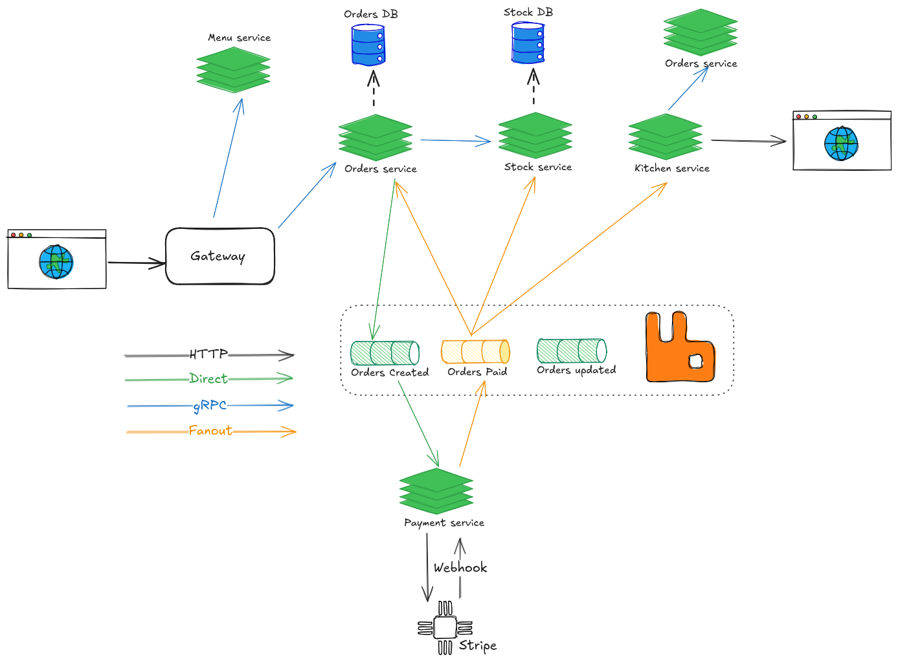

# Zesty

Zesty is an Order Management System built with Go microservices, designed to simplify the process of managing orders.The system integrates various services to provide efficient order processing.
Each service operates independently, providing scalability to handle workflows.The system uses MongoDB as its storage layer, integrates with Jaeger UI for tracing and HashiCorp Consul for service discovery
## Architecture

## Features

- **5 Microservices**: With kitchen, orders, payments stock, and gateway services
- **gRPC for Inter-service Communication**: Utilizes protocol buffers for efficient, strongly-typed communication
- **MongoDB**: Used as the primary storage layer for persistent data
- **RabbitMQ**: Employed as a message broker for asynchronous communication between services
- **Jaeger**: Integrated for distributed tracing and monitoring
- **Consul**: Provides service discovery and health checking capabilities