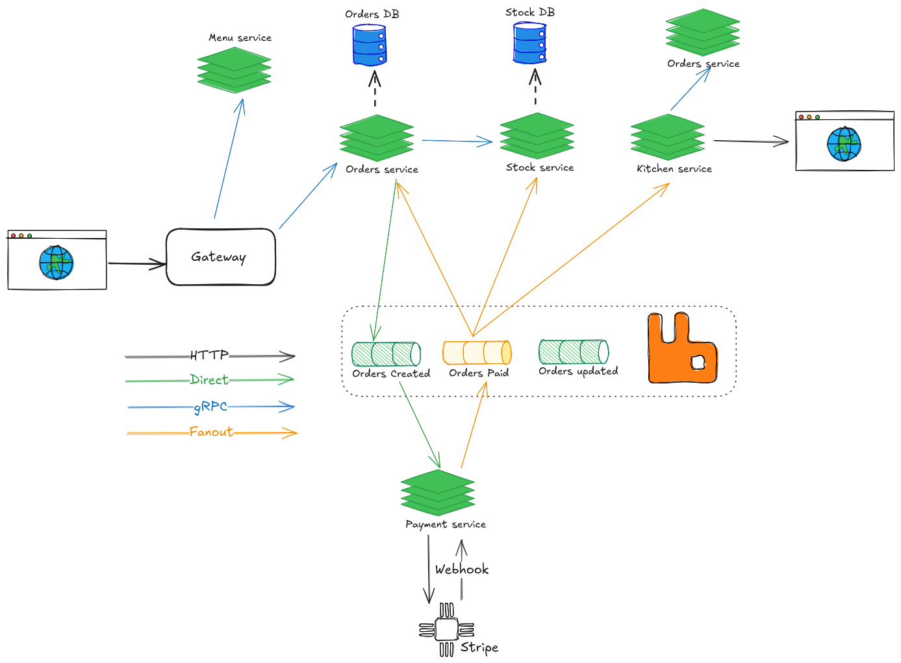

# Zesty

Zesty is an Order Management System built with Go microservices, designed to simplify the process of managing orders.The system integrates various services to provide efficient order processing.
Each service operates independently, providing scalability to handle workflows.The system uses MongoDB as its storage layer, integrates with Jaeger UI for tracing and HashiCorp Consul for service discovery
## Architecture


## Features

- Uses gRPC for efficient inter-service communication  
- RabbitMQ as the message broker to decouple services  
- HashiCorp Consul for service discovery  
- Integrated Stripe API for payment processing  
- Configured dead letter queues to improve reliability by handling unprocessed messages  

## Setup  

1. Clone the repository  

   ```sh
   git clone https://github.com/your-repo/order-management.git  
   ```
   
2. Install dependencies
   ```sh
   go work sync
   ```
   
3. Set up environment var - stripe api key, db addr and all

4. Start postgres, rabbitmq, consul, mongo
   ```sh
   docker-compose up -d  
   ```

5. Run each microservice (order, payment, gateway) with hot reloading 
   ```sh
   cd order && air
   cd gateway && air
   cd payment && air ...
   ```
